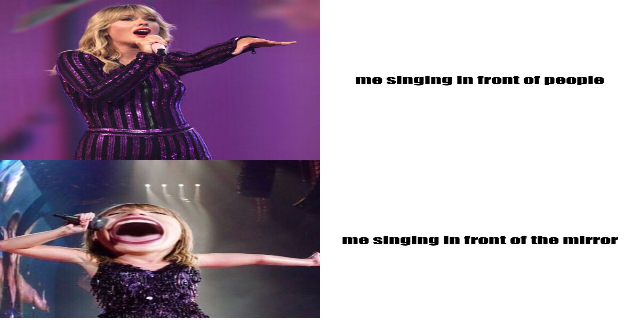
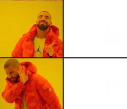

# My Taylor Swift meme
Below is a meme I created on RStudio using the R package {magick} (https://cran.r-project.org/web/packages/magick/vignettes/intro.html).

 

_**The R code I used to make the meme:**_
```library(magick)

normal_pic <- image_read("https://nestia-food.obs.ap-southeast-3.myhuaweicloud.com/201908/12/cd11cc4f1218c1a25b35f5bcf2bbfaca.jpg") %>%
image_scale(600)

crazy_pic <- image_read("https://i.pinimg.com/originals/8e/00/ee/8e00eec1f15e0dc1410c0d22e8341a8e.jpg") %>%
image_scale(600)

sing_people <- image_blank(width = 600, height = 600, color = "#ffffff") %>%
image_annotate(text = "me singing in front of people", color = "#000000", size = 40, font = "Impact", gravity = "center")

sing_mirror <- image_blank(width = 600, height = 600, color = "#ffffff") %>%
image_annotate(text = "me singing in front of the mirror", color = "#000000", size = 40, font = "Impact", gravity = "center")

first_row <- c(normal_pic, sing_people) %>%
image_append()

second_row <- c(crazy_pic, sing_mirror) %>%
image_append()

c(first_row, second_row) %>%
image_append(stack = TRUE)

image_write(meme, "my_meme.png")
```

## The inception of my Taylor Swift meme
Just like any Gen Z teenager, I am also a huge fan of memes because not only are they funny, but they are also super relatable because usually the scenarios shown in the meme have some relevance to my personal life. Just like any other meme, my Taylor Swift meme is not only funny, but its super relatable to me and hopefully others relate to it too. 

_**Inspirations behind the Taylor Swift meme:**_
* the fact that I listened to Taylor Swift growing up
* my love for singing and memes
* Seeing memes of Taylor Swift on the internet
* The layout of this meme was inspired by this iconic drake meme:

 

Plus I have a thing for making memes myself so this project was fun🥳
